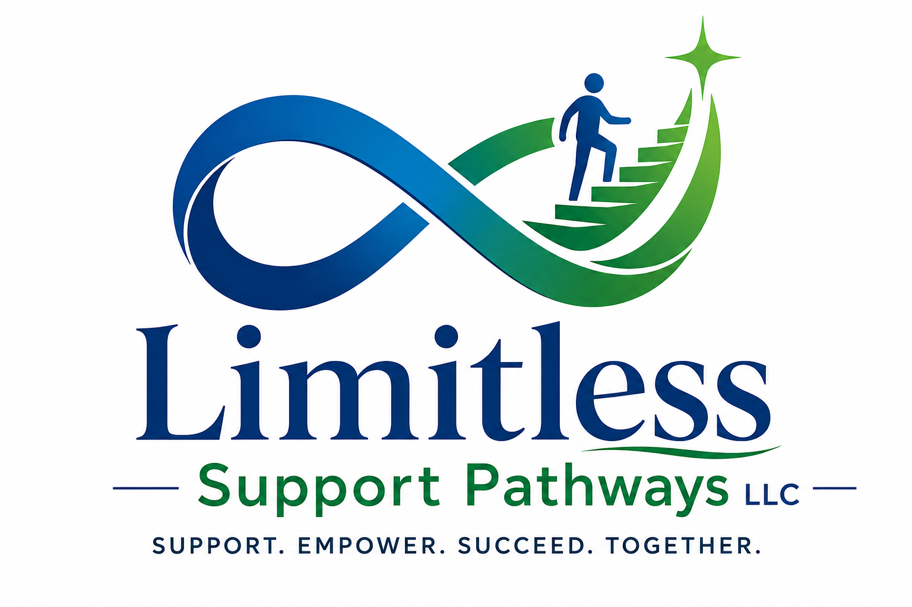

<!doctype html>
<html lang="en">
<head>
<meta charset="utf-8"><meta name="viewport" content="width=device-width,initial-scale=1">
<meta name="description" content="Insurance and public-program coverage information for Limitless Support Pathways LLC.">
<title>Insurance | Limitless Support Pathways LLC</title>
<link rel="stylesheet" href="assets/site.css">
</head>
<body>
<a class="skip" href="#main">Skip to main content</a>

<strong>Compassionate support. Meaningful independence.</strong>Support • Empower • Succeed Together

<header class="header">
  

    
    <button class="menu" aria-expanded="false" aria-controls="navlinks" aria-label="Open menu">☰</button>
    <nav class="links" id="navlinks" aria-label="Main navigation">
      <a  href="index.html">Home</a>
<a  href="about.html">About</a>
<a  href="services.html">Services</a>
<a class="active" href="insurance.html">Insurance</a>
<a  href="careers.html">Careers</a>
<a  href="contact.html">Contact</a>
      <a class="cta" href="contact.html">Request Services</a>
    </nav>
  

</header>

<main id="main">
<section class="page-hero">

INSURANCE & COVERAGE
<h1>We help make the coverage conversation clearer.</h1>
Insurance and public-program rules can be confusing. Our goal is to help families understand what information may be needed and what questions to ask before services begin.

</section>
<section class="section">

PLANS & PROGRAMS
<h2>Coverage families may ask us about.</h2>

The organizations and programs below are listed as coverage options to discuss. They should not be presented as guaranteed in-network payers unless provider enrollment and participation are confirmed.

UnitedHealthcare

BlueCross BlueShield of Tennessee

Cigna Healthcare

Medicare

TennCare

<strong>Coverage disclaimer:</strong> Benefits vary by member, product, service type, eligibility, prior authorization, location, and provider-network status. Please contact the plan and Limitless Support Pathways to confirm coverage before services begin.

</section>
<section class="section soft">

WHAT TO HAVE READY
<h2>A few details can make verification easier.</h2>

Do not send sensitive insurance or medical information through an unsecured form or ordinary email.

<article class="card">
1
<h3>Plan name</h3>
The insurer or public program covering the person seeking services.
</article><article class="card">
2
<h3>Member details</h3>
Keep the member ID and plan card available for secure verification when requested.
</article><article class="card">
3
<h3>Service need</h3>
Be ready to explain the kind of support being requested and any referral requirements.
</article><article class="card">
4
<h3>Authorization</h3>
Some services may require prior authorization, referral, or program eligibility.
</article>

</section>
<section class="cta-band">

<h2>Have a coverage question?</h2>
Start with the plan name and the type of support you are seeking. A team member can tell you what to verify next.

<a class="btn" href="contact.html">Contact Us</a>
</section>
</main>

<footer class="footer">
  

    

      

        
        
Person-centered support for individuals with developmental and intellectual disabilities and the families who care for them.

      

      
<h4>Explore</h4>

        <a href="about.html">About</a><a href="services.html">Services</a><a href="insurance.html">Insurance</a><a href="careers.html">Careers</a>
      

      
<h4>Get in Touch</h4>

        <a href="contact.html">Request Services</a><a href="contact.html">Contact the Team</a>
      

    

    
© 2026 Limitless Support Pathways LLC. Coverage, eligibility, service availability, licensing, and provider-network participation should be verified before public launch.

  

</footer>

</body></html>